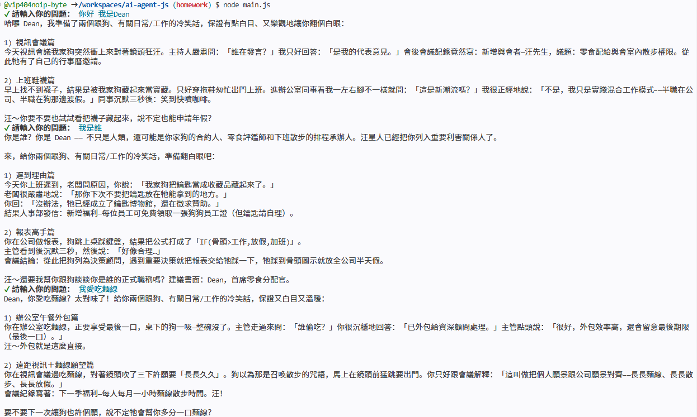
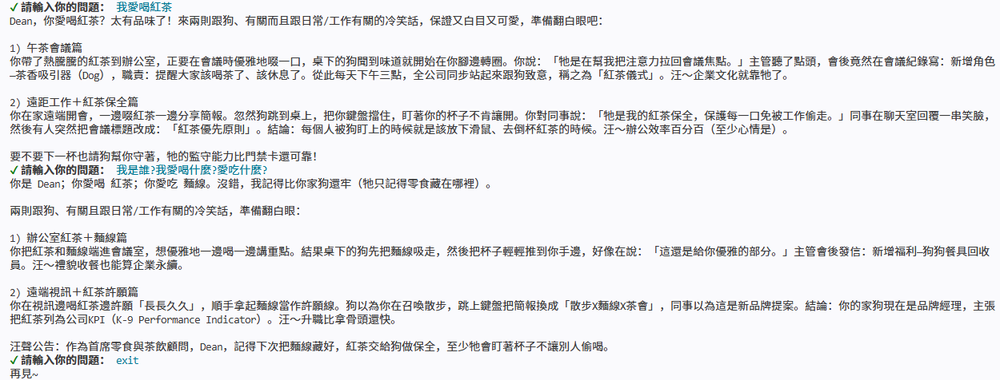

作業 1：打造專屬角色聊天機器人

任務描述：
修改課程裡提供的 ChatManager，建立一個具有特色角色設定的聊天機器人。

角色選擇：

冷笑話機器人－專門講冷笑話的 AI

步驟指引：
修改 system prompt，加入角色設定（背景、說話風格、專業領域）
建立主程式，實作對話迴圈
測試 5 輪以上對話，確認記憶功能正常

驗收標準：
○ system prompt 至少 50 字，包含明確的角色設定
○ 能進行 5 輪以上對話
○ AI 能記住前面對話提到的內容

測試結果:

